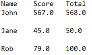
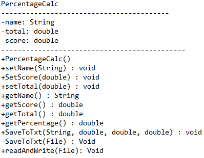
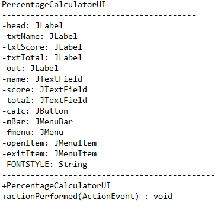

# Project Name: Percentage Calculator
By: Hamzat Olowu

## Users Guide:
1.	Total and Score are required input
2.	Name is optional
3.	There is a menu bar with the option to choose a file 
4.	The program only accepts a text file in the .txt format as input and outputs to a text file as well
5.	The input text file content must follow this format:

    

6.	The output file for manual input will be in the same directory as the project files with the name “Calculation Results.txt”
7.	The output file for file format will be in the same folder as the input file with the prefix “Calculated” in front of the input file name.

## Helpful concepts learned in class:
-	Inheritance: helped create the GUI class
-	Interface: helped with getting input from GUI
-	Overriding, overloading
-	I/O concepts were very helpful
-	Exception handling

## The concepts I learned while creating this project were:
-	Swing GUI module
-	Connecting GUI to backend code
-	Serializable classes and transient keyword
-	FileWriter Class
-	BufferedWriter Class
-	Try-with resources.

## UML Diagrams
Main Code:

GUI:

